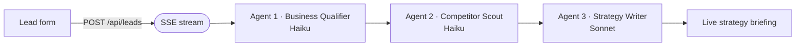

# Pacific Growth Co

AI-powered lead qualification landing page — three Claude agents analyze an inbound prospect's business, identify competitors, and stream a custom 30/90-day marketing strategy briefing in real time.

**Live demo:** https://pacific-growth-co.vercel.app

---

## What it is

Pacific Growth Co is a Next.js marketing agency landing page with a working AI backend. When a prospect submits the lead form, a three-step Claude pipeline fires: one model fetches and classifies their homepage, a second infers their top competitors, and a third writes a concrete strategy briefing specific to their business. The entire pipeline streams back to the browser as Server-Sent Events so users watch each agent finish in real time — no polling, no page reload.

Leads are persisted to the filesystem (ephemeral `/tmp` on Vercel, persistent `data/` locally) and logged as structured `NEW_LEAD` JSON lines to Vercel runtime logs. An optional Discord webhook fires a rich embed on every submission. A token-gated admin page at `/admin/leads` shows recent submissions with their full briefings.

---

## Architecture at a glance



## Features

- **Streaming agent UI** — `AgentSwarm` component renders three agent cards with live `Queued / Working / Done` status pills driven by SSE events from the API route
- **Three-step Claude pipeline** — sequential agents run on the server: Business Qualifier → Competitor Scout → Strategy Writer (see *How it works* below)
- **SSRF guard** — the homepage fetch in step 1 rejects loopback, private-range, and cloud-metadata URLs before any network request is made
- **Zod validation** — all form fields are validated server-side before the AI pipeline starts; validation errors return plain JSON with a 422 status
- **Graceful JSON fence stripping** — Haiku frequently wraps JSON output in markdown code fences; `lib/ai.ts` strips them before `JSON.parse` so the pipeline never breaks on model formatting quirks
- **Dual storage** — `lib/leads.ts` auto-detects the Vercel/Lambda environment and writes to `/tmp`; locally it writes to `data/leads.json` with atomic rename-on-write
- **Discord notifications** — optional webhook posts a rich embed (briefing preview, budget, industry, competitor list) on every new lead; times out after 5 s and never blocks lead capture
- **Token-gated admin view** — `/admin/leads?token=YOUR_TOKEN` shows all leads from the current serverless instance; safe-by-default when `ADMIN_TOKEN` is unset

---

## How it works

### Request flow

```
Browser form submit
  → POST /api/leads
      │
      ├─ Zod validation (businessName, websiteUrl, email, phone,
      │                  adSpend, industry, headache)
      │
      ├─ Open ReadableStream → text/event-stream response
      │
      ├─ Agent 1 — Business Qualifier (claude-haiku-4-5, 256 tokens)
      │   • SSRF-guarded fetch of the prospect's homepage (5 s timeout)
      │   • Strips <script>, <style>, HTML tags; takes first 3000 chars
      │   • Asks Haiku for { classification, valueProps[] } as JSON
      │   • Sends SSE: { phase:"qualifier", status:"running|complete", ... }
      │
      ├─ Agent 2 — Competitor Scout (claude-haiku-4-5, 256 tokens)
      │   • Receives websiteUrl, industry, classification from Agent 1
      │   • Asks Haiku to infer 3 direct competitors as a JSON string array
      │   • Sends SSE: { phase:"competitors", status:"running|complete", competitors }
      │
      ├─ Agent 3 — Strategy Writer (claude-sonnet-4-5, 600 tokens)
      │   • Receives all context from Agents 1 & 2
      │   • Writes a 3-paragraph briefing: opportunity / 30-day tactics / 90-day results
      │   • Sends SSE: { phase:"briefing", status:"running|complete", briefing }
      │
      ├─ saveLead → /tmp/pacific-growth-co/leads.json (best-effort, non-fatal)
      ├─ console.log NEW_LEAD → Vercel runtime logs (always)
      ├─ notifyNewLead → Discord webhook (optional, non-blocking)
      └─ Sends SSE: { phase:"done", status:"complete", id }

Browser
  → reads SSE chunks, updates AgentSwarm UI per event
  → renders final briefing card on { phase:"done" }
```

Each Claude call is made via the official `@anthropic-ai/sdk`. The client is lazily initialized so a missing `ANTHROPIC_API_KEY` surfaces as a 503 at request time rather than a crash at module load.

---

## Tech stack


| Layer | Choice |
|---|---|
| Framework | Next.js 14 App Router (`app/`) |
| Language | TypeScript 5 |
| Styling | Tailwind CSS 3 |
| AI models | `claude-haiku-4-5` (Agents 1 & 2), `claude-sonnet-4-5` (Agent 3) |
| Validation | Zod |
| Icons | Lucide React |
| Deployment | Vercel (Node.js runtime) |

---

## Getting started

### Prerequisites

- Node.js 18+
- An [Anthropic API key](https://console.anthropic.com)

### Install and run

```bash
git clone https://github.com/liamssbusiness/pacific-growth-co.git
cd pacific-growth-co
npm install

cp .env.example .env.local
# Edit .env.local and fill in the variables below
npm run dev
# Open http://localhost:3000
```

### Environment variables

| Variable | Required | Description |
|---|---|---|
| `ANTHROPIC_API_KEY` | Yes | Anthropic API key — powers all three Claude agents |
| `ADMIN_TOKEN` | No | Any random string; unlocks `/admin/leads?token=...` |
| `DISCORD_WEBHOOK_URL` | No | Discord incoming webhook URL for lead alerts |

Local leads are written to `data/leads.json` and `data/notifications.log` (both gitignored). On Vercel, leads write to `/tmp` — ephemeral per function instance. For a persistent audit trail, filter Vercel runtime logs for `NEW_LEAD`.

### Other scripts

```bash
npm run build   # production build
npm start       # run the production build locally
npm run lint    # ESLint
```

---

## Project structure

```
pacific-growth-co/
├── app/
│   ├── page.tsx              # Landing page (Hero → WhatYouGet → HowItWorks → LeadForm → Footer)
│   ├── layout.tsx            # Root layout
│   ├── globals.css           # Tailwind base styles
│   ├── admin/leads/page.tsx  # Token-gated admin view
│   └── api/leads/route.ts    # POST handler — SSE stream orchestrating the three agents
├── components/
│   ├── AgentSwarm.tsx        # Live agent status UI (Queued / Working / Done cards)
│   ├── LeadForm.tsx          # Form + SSE reader + result display
│   ├── Hero.tsx
│   ├── HowItWorks.tsx
│   ├── WhatYouGet.tsx
│   └── Footer.tsx
├── lib/
│   ├── ai.ts                 # Anthropic SDK calls: qualifyBusiness, findCompetitors, generateBriefing
│   ├── leads.ts              # Lead storage (auto-routes /tmp vs data/)
│   └── notify.ts             # Discord webhook notification
├── data/                     # Local lead storage (gitignored)
└── .env.example
```

---

Built by [Liam Schnorr](https://github.com/liamssbusiness)
